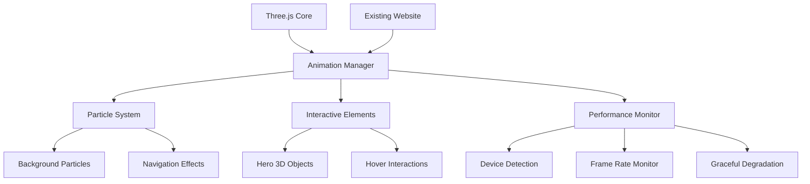

# Design Document: Three.js Animations Enhancement

## Overview

This design document outlines the technical implementation for integrating Three.js animations into the existing GitHub.io academic portfolio website. The solution focuses on creating engaging visual elements while maintaining excellent performance and preserving the site's professional aesthetic. The implementation will use modern Three.js techniques including BufferGeometry for particle systems, instanced rendering for performance, and responsive design patterns for cross-device compatibility.

## Architecture

### System Components



### Integration Strategy

The animation system will be designed as a progressive enhancement layer that:
- Initializes after the existing DOM content loads
- Operates independently of existing JavaScript functionality
- Gracefully degrades when WebGL is unavailable
- Integrates seamlessly with the current Parcel build system

## Components and Interfaces

### 1. Animation Manager (`AnimationManager.js`)

**Purpose**: Central coordinator for all Three.js animations and performance monitoring.

**Key Methods**:
```javascript
class AnimationManager {
  constructor(options = {})
  init()
  start()
  stop()
  resize()
  updatePerformanceSettings(deviceType)
}
```

**Responsibilities**:
- Initialize Three.js scene, camera, and renderer
- Coordinate between different animation components
- Handle window resize events
- Monitor performance and adjust quality settings
- Manage animation lifecycle (start/stop/pause)

### 2. Particle System (`ParticleSystem.js`)

**Purpose**: Creates and manages background particle animations using BufferGeometry for optimal performance.

**Technical Implementation**:
- Uses `THREE.BufferGeometry` with `Float32Array` for position data
- Implements `THREE.Points` with custom `THREE.PointsMaterial`
- Particle count: 2000 on desktop, 500 on mobile
- Color scheme: Primary (#7a9b76) with opacity variations

**Key Features**:
- Floating particles with subtle movement
- Mouse interaction causing particle displacement
- Automatic particle count adjustment based on device capabilities
- Smooth animation using `requestAnimationFrame`

### 3. Interactive Elements (`InteractiveElements.js`)

**Purpose**: Manages 3D objects in the hero section and interactive hover effects.

**Hero Section 3D Object**:
- Wireframe geometric shape (icosahedron or torus)
- Slow rotation animation (0.005 radians per frame)
- Mouse parallax effect with dampening
- Positioned to complement existing profile image

**Navigation Enhancements**:
- 3D hover effects using CSS transforms and Three.js
- Smooth transition animations (300ms duration)
- Enhanced mobile menu animations

### 4. Performance Monitor (`PerformanceMonitor.js`)

**Purpose**: Ensures optimal performance across all devices and graceful degradation.

**Device Detection**:
```javascript
const deviceCapabilities = {
  desktop: { particles: 2000, quality: 'high' },
  tablet: { particles: 1000, quality: 'medium' },
  mobile: { particles: 500, quality: 'low' }
}
```

**Performance Metrics**:
- Frame rate monitoring (target: 60fps desktop, 30fps mobile)
- WebGL capability detection
- Reduced motion preference detection
- Automatic quality adjustment based on performance

## Data Models

### Particle Data Structure

```javascript
const particleData = {
  positions: Float32Array,      // x, y, z coordinates for each particle
  velocities: Float32Array,     // movement vectors
  colors: Float32Array,         // RGB values with alpha
  sizes: Float32Array,          // individual particle sizes
  count: Number                 // total particle count
}
```

### Animation State

```javascript
const animationState = {
  isRunning: Boolean,
  currentFrame: Number,
  deltaTime: Number,
  mousePosition: { x: Number, y: Number },
  deviceType: String,           // 'desktop', 'tablet', 'mobile'
  performanceLevel: String      // 'high', 'medium', 'low'
}
```

### Configuration Object

```javascript
const config = {
  particles: {
    count: { desktop: 2000, tablet: 1000, mobile: 500 },
    size: { min: 1, max: 3 },
    speed: { min: 0.001, max: 0.003 },
    colors: ['#7a9b76', '#5a7a56', '#9ab896']
  },
  performance: {
    targetFPS: { desktop: 60, mobile: 30 },
    maxDrawCalls: 100,
    enableShadows: { desktop: true, mobile: false }
  },
  interactions: {
    mouseInfluence: 0.1,
    dampening: 0.95,
    transitionDuration: 300
  }
}
```

Now I need to use the prework tool to analyze the acceptance criteria before writing the correctness properties:
## Correctness Properties

*A property is a characteristic or behavior that should hold true across all valid executions of a system—essentially, a formal statement about what the system should do. Properties serve as the bridge between human-readable specifications and machine-verifiable correctness guarantees.*

After analyzing the acceptance criteria, the following properties have been identified for property-based testing:

### Property 1: Particle Animation Consistency
*For any* valid animation frame, particles should have positions that change over time and remain within the viewport boundaries.
**Validates: Requirements 1.1**

### Property 2: Device-Based Particle Scaling
*For any* device type detection, mobile devices should have significantly fewer particles than desktop devices (at least 50% reduction).
**Validates: Requirements 1.5**

### Property 3: Color Palette Compliance
*For any* particle in the system, its color values should fall within the defined color palette range based on the primary color (#7a9b76).
**Validates: Requirements 1.4**

### Property 4: Interactive Element Responsiveness
*For any* mouse interaction event in the hero section, 3D elements should update their position or rotation properties within one animation frame.
**Validates: Requirements 2.1, 2.3**

### Property 5: 3D Object Rotation Continuity
*For any* animation frame, the hero section 3D object should have a rotation value that increases monotonically over time.
**Validates: Requirements 2.2**

### Property 6: Navigation Animation Timing
*For any* navigation interaction, animations should complete within the specified 300ms duration limit.
**Validates: Requirements 3.1, 3.2, 3.3, 3.5**

### Property 7: Functionality Preservation
*For any* existing website feature (navigation, GitHub API, mobile menu), it should continue to work correctly after animation system initialization.
**Validates: Requirements 3.4, 5.4, 6.2**

### Property 8: Performance Threshold Maintenance
*For any* animation sequence on desktop devices, the frame rate should remain above 50fps (allowing 10fps buffer below target 60fps).
**Validates: Requirements 4.4**

### Property 9: Load Time Performance
*For any* page load sequence, the time from DOM ready to first animation frame should not exceed 500ms.
**Validates: Requirements 4.1**

### Property 10: Mobile Performance Optimization
*For any* mobile device detection, animation complexity (particle count, effects) should be automatically reduced compared to desktop settings.
**Validates: Requirements 4.2**

### Property 11: Graceful Degradation
*For any* environment where WebGL is unavailable, the animation system should initialize fallback behavior without throwing errors.
**Validates: Requirements 4.3**

### Property 12: Accessibility Compliance
*For any* user with reduced motion preferences enabled, animations should be disabled or significantly reduced.
**Validates: Requirements 4.5**

### Property 13: Scroll-Based Animation Triggers
*For any* scroll event that brings content into viewport, reveal animations should be triggered for the appropriate content blocks.
**Validates: Requirements 5.1**

### Property 14: Repository Card Enhancement
*For any* repository card hover interaction, 3D transform effects should be applied while preserving the original hover functionality.
**Validates: Requirements 5.3**

### Property 15: Animation Staggering
*For any* content loading sequence, animations should have different start times to create a staggered effect rather than all starting simultaneously.
**Validates: Requirements 5.5**

### Property 16: Error Resilience
*For any* Three.js error or exception, the existing website functionality should continue to operate normally.
**Validates: Requirements 6.4**

## Error Handling

### WebGL Compatibility
- Detect WebGL support using `WebGLRenderingContext`
- Fallback to CSS animations for basic effects when WebGL unavailable
- Display static content when both WebGL and CSS animations fail

### Performance Degradation
- Monitor frame rate using `performance.now()`
- Automatically reduce particle count if FPS drops below threshold
- Disable complex effects on low-performance devices

### Memory Management
- Dispose of Three.js objects properly to prevent memory leaks
- Use object pooling for frequently created/destroyed particles
- Implement cleanup on page unload

### Error Boundaries
```javascript
try {
  // Three.js initialization
} catch (error) {
  console.warn('Animation system failed to initialize:', error);
  // Continue with static website functionality
}
```

## Testing Strategy

### Dual Testing Approach

The testing strategy employs both unit tests and property-based tests to ensure comprehensive coverage:

**Unit Tests**: Focus on specific examples, edge cases, and integration points
- WebGL capability detection
- Device type classification
- Animation initialization sequences
- Error handling scenarios
- Build system integration

**Property-Based Tests**: Verify universal properties across all inputs using a JavaScript property testing library (fast-check)
- Each property test will run a minimum of 100 iterations
- Tests will generate random inputs (mouse positions, device types, animation states)
- Each test will be tagged with: **Feature: threejs-animations, Property {number}: {property_text}**

### Testing Configuration

**Property Test Setup**:
- Library: fast-check for JavaScript property-based testing
- Minimum iterations: 100 per property test
- Test environment: Jest with jsdom for DOM simulation
- WebGL mocking: Use headless-gl for Three.js testing

**Performance Testing**:
- Frame rate monitoring in test environment
- Bundle size analysis with webpack-bundle-analyzer
- Load time measurement using Performance API

**Cross-Device Testing**:
- Automated testing across different viewport sizes
- Device capability simulation
- Reduced motion preference testing

### Integration Testing

**Build System Integration**:
- Verify Parcel successfully bundles Three.js dependencies
- Test that existing build process remains unchanged
- Validate that production builds include optimized Three.js assets

**Compatibility Testing**:
- Test graceful degradation when WebGL is disabled
- Verify functionality on browsers without Three.js support
- Ensure mobile responsiveness is maintained